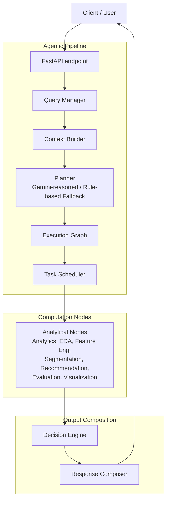

# ASTER Architecture

## System Overview

**Agentic Segmentation Through Execution & Reasoning (ASTER)** is an intelligent, agentic analytics platform capable of transforming natural-language business queries into executable analytical workflows. 

Rather than relying on fixed pipelines, ASTER dynamically translates a user's natural language query into an agentic pipeline, returning a structured response containing segmented customer data, statistical summaries, recommendations, visualisations, and business-focused explanations. 

The core architecture follows a strict separation of concerns where planning, scheduling, computation, and explainability are completely decoupled.

## Full Request Flow

## Module Responsibilities

The system is built on the principle that every module should have a single responsibility.

### 1. Frontend
*   **Takes as input:** User interactions (queries).
*   **Produces:** API requests, visual presentation of results (charts, tables).
*   **Critically DOES NOT:** Contain or execute any business or analytical logic.

### 2. API (FastAPI)
*   **Takes as input:** HTTP requests (e.g., `POST /query`).
*   **Produces:** HTTP responses with JSON payload.
*   **Critically DOES NOT:** Perform any analytics. It strictly handles endpoints, validation, and request forwarding.

### 3. Query Manager
*   **Takes as input:** Raw user queries from the API.
*   **Produces:** Normalised queries routed into the planning workflow.
*   **Critically DOES NOT:** Make decisions about what analytical nodes to run. 

### 4. Context Builder
*   **Takes as input:** Normalised query text.
*   **Produces:** Structured context extracting intent, filters, entities, and output formatting expectations.
*   **Critically DOES NOT:** Plan the execution graph.

### 5. Planner
*   **Takes as input:** Structured query context.
*   **Produces:** A selected set of analytical nodes required to satisfy the query, acting as an execution workflow.
*   **Critically DOES NOT:** Perform any computation, analytics, or machine learning. It decides *WHAT* needs to be executed, not *HOW* it is executed.

### 6. Execution Graph
*   **Takes as input:** The nodes selected by the Planner.
*   **Produces:** A topological representation of node dependencies.
*   **Critically DOES NOT:** Execute the nodes.

### 7. Scheduler
*   **Takes as input:** The Execution Graph.
*   **Produces:** Coordinated execution of analytical nodes in dependency order, passing required inputs (context) between them.
*   **Critically DOES NOT:** Make planning decisions, reorder dependencies, or modify analytical outputs. It determines *WHEN* a node executes.

### 8. Analytical Nodes
*   **Takes as input:** Data from previous nodes via the Scheduler (e.g. raw dataset, engineered features).
*   **Produces:** Independent computational output for their specific domain (e.g., descriptive statistics, cluster labels, evaluation metrics).
*   **Critically DOES NOT:** Invoke or call other nodes directly. Nodes decide *HOW* the computation is performed, fully decoupled from orchestration.

### 9. Decision Engine
*   **Takes as input:** Analytical outputs (specifically segmentation results and engineered features).
*   **Produces:** Business explanations and natural-language justifications for the generated clusters and recommendations using SHAP, LIME, or rule-based fallback.
*   **Critically DOES NOT:** Modify the mathematical predictions or recalculate clusters. It explains *WHY* a decision was made.

### 10. Response Composer
*   **Takes as input:** The collective outputs from all executed nodes and the Decision Engine.
*   **Produces:** A single, cohesive JSON response object.
*   **Critically DOES NOT:** Perform any data transformations beyond assembling the final payload structure.

### 11. Event Bus & Live Telemetry
*   **Takes as input:** Execution lifecycle events (e.g., query_started, node_started, node_completed) emitted by the Scheduler.
*   **Produces:** Real-time WebSocket broadcasts (`/dashboard/live`) and persisted execution metrics in Decision Memory.
*   **Critically DOES NOT:** Block or delay the main analytical execution pipeline. It operates as a decoupled, non-blocking telemetry stream.

## The Model Registry

The Model Registry is a central discovery and selection mechanism for analytical algorithms. It abstracts the instantiation of machine learning models from the nodes. 

Currently, the registry exposes callable factories for:
*   **KMeans** (baseline deterministic clustering)
*   **DBSCAN** (density-based spatial clustering)
*   **HDBSCAN** (hierarchical density-based clustering, gated dynamically by the `scikit-learn` version)
*   **Rule Engine** (recommendation logic)

**Algorithm Selection:** During segmentation, algorithm selection is Gemini-assisted. The LLM evaluates the query context and recommends an algorithm from the active registry entries, applying bounded parameter sanitisation. The node retains a deterministic core by using the LLM's recommendation to instantiate a real factory from the registry, falling back to KMeans if the chosen algorithm fails or yields unviable (e.g. zero or one) clusters.

## Decision Memory

The **Decision Memory** is a SQLite-backed exact-key caching module (`backend/data/decision_memory.db`) that stores previously resolved query workflows.

*   **What it caches:** It caches the exact, normalised query string along with the complete generated JSON response.
*   **Read / Write:** The query manager checks the cache before planning. On an exact-key hit, it bypasses the entire planner/scheduler/nodes pipeline. After a cache miss executes successfully, the result is stored via a fire-and-forget write path.
*   **Exact-Key vs Semantic:** The cache deliberately uses *exact-key* matching (lowercased, whitespace-trimmed text) only. Semantic caching (using embeddings or vector stores for similarity) was explicitly identified as a Phase 10 feature and deliberately deferred to maintain MVP simplicity.

## Deferred / Out of Scope Architecture

ASTER follows an iterative development philosophy where optimization and advanced integrations happen only after correctness is verified. As part of the Phase 10 "enhancements, not MVP requirements" framing, the following components are architecturally documented but deliberately deferred:

*   **Authentication & Session Management:** Currently, all queries are stateless. Persistent user sessions are deferred.
*   **Semantic Caching:** Matching queries by intent similarity using embeddings.
*   **PostgreSQL / Redis:** SQLite and Python dictionaries are used for the MVP to maintain zero-configuration portability.
*   **Distributed Execution / Parallel Scheduler:** The current scheduler is single-threaded and executes the topological graph sequentially.
