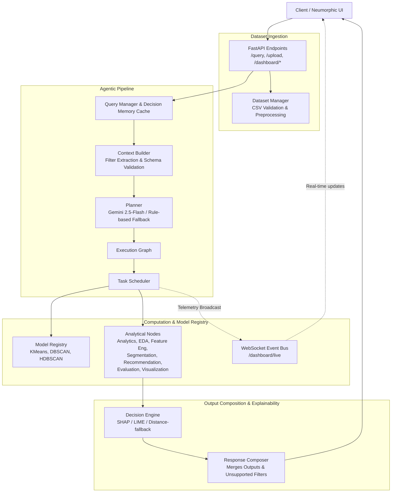

# ASTER Architecture

## System Overview

**Agentic Segmentation Through Execution & Reasoning (ASTER)** is an intelligent, agentic analytics platform capable of transforming natural-language business queries into executable analytical workflows. 

Rather than relying on fixed pipelines, ASTER dynamically translates a user's natural language query into an agentic pipeline, returning a structured response containing segmented customer data, statistical summaries, recommendations, visualisations, unsupported filter alerts, and business-focused explanations. 

The core architecture follows a strict separation of concerns where planning, scheduling, computation, explainability, and telemetry are completely decoupled.

## Full Request Flow

## Module Responsibilities

The system is built on the principle that every module should have a single responsibility.

### 1. Frontend
*   **Takes as input:** User interactions (natural-language queries, custom CSV file uploads).
*   **Produces:** API HTTP requests, real-time WebSocket connection handling, visual presentation of results (interactive scatter charts, execution traces, metric cards).
*   **Critically DOES NOT:** Contain or execute any business, analytical, or machine-learning logic.

### 2. API (FastAPI Layer)
*   **Takes as input:** HTTP requests (`POST /query`, `POST /upload`, `GET /dashboard/node-stats`, `GET /dashboard/graph`) and WebSocket connections (`/dashboard/live`).
*   **Produces:** HTTP JSON payloads, HTML page serving, and real-time telemetry streaming.
*   **Critically DOES NOT:** Perform any analytics directly. It strictly handles endpoints, file upload validation, and request forwarding.

### 3. Dataset Manager
*   **Takes as input:** Uploaded raw CSV files.
*   **Produces:** Validated dataset storage in `backend/data/raw/` and auto-triggered feature engineering output in `backend/data/processed/`.
*   **Critically DOES NOT:** Plan or execute user query workflows.

### 4. Query Manager & Decision Memory
*   **Takes as input:** Raw user queries from the API.
*   **Produces:** Normalised queries routed into the planning workflow, or instant responses served from SQLite cache (`backend/data/decision_memory.db`) on exact-key hits. Cache hits are enriched with current `routing_reason` metadata from the Context Builder.
*   **Critically DOES NOT:** Generate new analytical plans on cache hits.

### 5. Context Builder & Filter Validator
*   **Takes as input:** Normalised query text and dataset schema metadata.
*   **Produces:** Structured context object containing extracted intent (TF-IDF cosine similarity over canonical example phrases, with legacy keyword lists retained but deprecated), requested cluster counts, target entities, `intent_routing` metadata (matched example + similarity score), and a list of `unsupported_filters` (search constraints not present in the dataset schema). May return a clarification payload when the query is too vague, relies only on unsupported filters, or uses ambiguous relative thresholds.
*   **Critically DOES NOT:** Plan the execution graph.

### 6. Planner
*   **Takes as input:** Structured query context.
*   **Produces:** A selected set of analytical nodes required to satisfy the query, acting as an execution workflow.
*   **Critically DOES NOT:** Perform any computation, analytics, or machine learning. It decides *WHAT* needs to be executed, not *HOW* it is executed.

### 7. Execution Graph
*   **Takes as input:** The nodes selected by the Planner.
*   **Produces:** A topological representation of node dependencies.
*   **Critically DOES NOT:** Execute the nodes.

### 8. Scheduler & Telemetry
*   **Takes as input:** The Execution Graph.
*   **Produces:** Coordinated execution of analytical nodes in dependency order, timing metrics per node, and live Pub/Sub WebSocket event emission (`query_started`, `node_started`, `node_completed`).
*   **Critically DOES NOT:** Make planning decisions, reorder dependencies, or modify analytical outputs. It determines *WHEN* a node executes.

### 9. Analytical Nodes
*   **Takes as input:** Data from previous nodes via the Scheduler (e.g. raw dataset, engineered features).
*   **Produces:** Independent computational output for their specific domain (e.g., descriptive statistics, cluster labels, evaluation metrics).
*   **Critically DOES NOT:** Invoke or call other nodes directly. Nodes decide *HOW* the computation is performed, fully decoupled from orchestration.

### 10. Decision Engine (Explainability)
*   **Takes as input:** Analytical outputs (specifically segmentation results and engineered features).
*   **Produces:** Business explanations and natural-language justifications for generated clusters and recommendations using SHAP, LIME, or distance-based rule fallback.
*   **Critically DOES NOT:** Modify the mathematical predictions or recalculate clusters. It explains *WHY* a decision was made.

### 11. Response Composer
*   **Takes as input:** The collective outputs from all executed nodes, the Decision Engine, and unsupported filter warnings.
*   **Produces:** A single, cohesive JSON response object adhering to the canonical system contract.
*   **Critically DOES NOT:** Perform data transformations beyond assembling the final payload structure.

---

## The Model Registry

The Model Registry is a central discovery and selection mechanism for analytical algorithms. It abstracts the instantiation of machine learning models from the nodes. 

Currently, the registry exposes callable factories for:
*   **KMeans** (baseline deterministic clustering)
*   **DBSCAN** (density-based spatial clustering)
*   **HDBSCAN** (hierarchical density-based clustering, gated dynamically by the `scikit-learn` version)
*   **Rule Engine** (recommendation logic)

**Algorithm Selection:** During segmentation, algorithm selection is Gemini-assisted. The LLM evaluates the query context and recommends an algorithm from the active registry entries, applying bounded parameter sanitisation. The node retains a deterministic core by using the LLM's recommendation to instantiate a real factory from the registry, falling back to KMeans if the chosen algorithm fails or yields unviable (e.g. zero or one) clusters.

---

## Decision Memory

The **Decision Memory** is a SQLite-backed exact-key caching module (`backend/data/decision_memory.db`) that stores previously resolved query workflows.

*   **What it caches:** It caches the exact, normalised query string along with the complete generated JSON response.
*   **Read / Write:** The query manager checks the cache before planning. On an exact-key hit, it bypasses the entire planner/scheduler/nodes pipeline. After a cache miss executes successfully, the result is stored via a fire-and-forget write path.
*   **Exact-Key vs Semantic:** The cache deliberately uses *exact-key* matching (lowercased, whitespace-trimmed text) only. Semantic caching (using embeddings or vector stores for similarity) was explicitly identified as a Phase 10 feature and deliberately deferred to maintain MVP simplicity.

---

## Deferred / Out of Scope Architecture

ASTER follows an iterative development philosophy where optimization and advanced integrations happen only after correctness is verified. The following components are architecturally documented but deliberately deferred:

*   **Authentication & Session Management:** Currently, all queries are stateless. Persistent user sessions are deferred.
*   **Semantic Caching:** Matching queries by intent similarity using vector embeddings.
*   **PostgreSQL / Redis:** SQLite and Python in-memory channels are used for portability.
*   **Multi-threaded Parallel Scheduler:** The scheduler executes topological graphs sequentially to ensure predictable execution traces.

